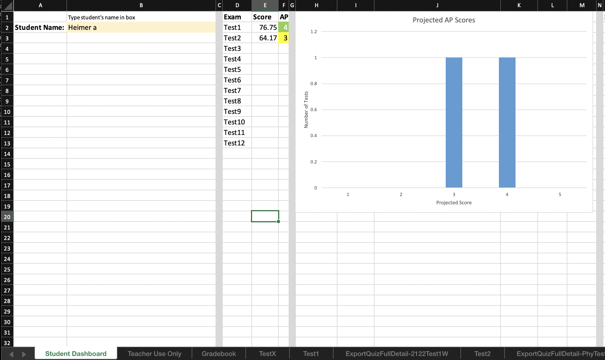
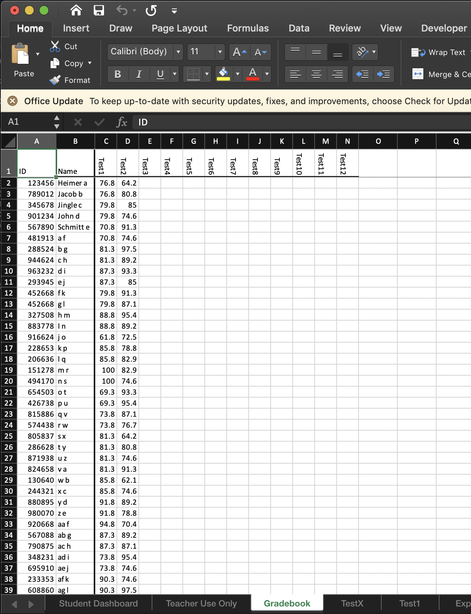
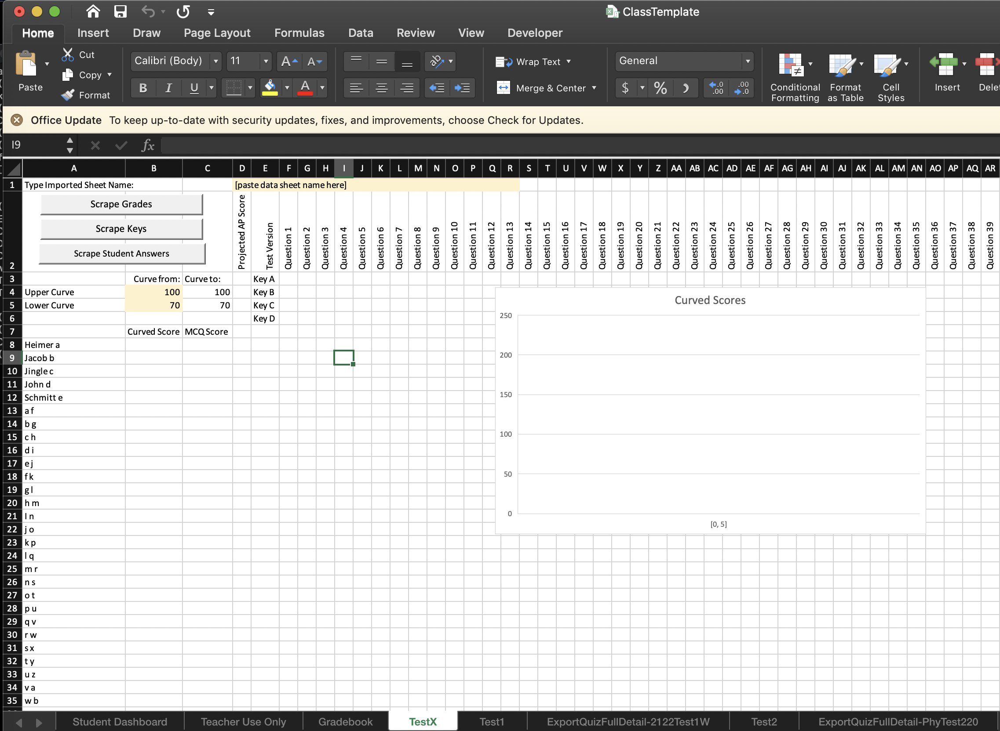
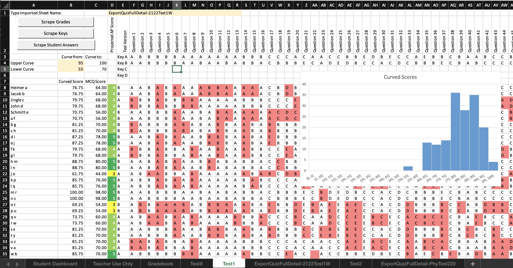

# Automated Gradebook
by Nathan Wong

I made this automated gradebook when I was a teacher at the Liberal Arts and Science Academy to make my (and my co-teachers' lives easier). It is designed to integrate with ZipGrade which was the multiple choice test scanning software we were using at the time.

### Data Sources:
The score data is real data from some of my exams, and the names are all fake to protect my students' identities.

### Sample Screenshots:

This first tab in the notebook is a view for students. I would have students come up to my desk to assess their progress for midterms, finals, and the AP test. This would give them an idea of which tests (and therefore topics) they should focus on.

This is where a teacher inputs their student roster. The student roster will automatically populate by copying this list in the other pages. This is also how I would calculate projected AP test scores; I would put the cutoff percentages of the last several years into their respective cells and average them. My tests were usually AP difficulty, so students could see what AP Score they wouldve gotten for particular tests.

This page automatically updates with an overview of test scores. I liked these as a self-reflection of how classes were performing on certain topics, and what I needed to focus on improving in my own craft.

This is a blank template page for the notebook user to copy and paste to create new tests.

This is what a filled out spreadsheet would look like after pressing the three "Scrape" buttons on the top left of the spreadsheet. The VBA scripts knew which sheet to scrape based on what the user types in the top row. The red cells indicate which questions students got wrong, based on the test key corresponding to their test. Notice I have put in an algorithm to automatically curved the test scores based on user-inputted parameters.